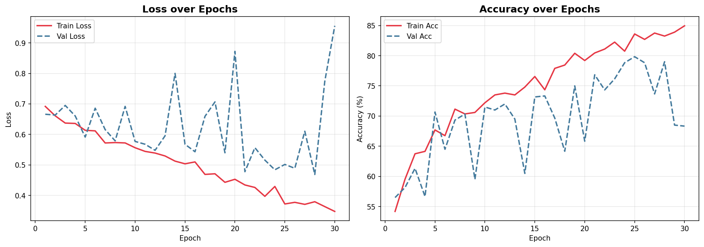
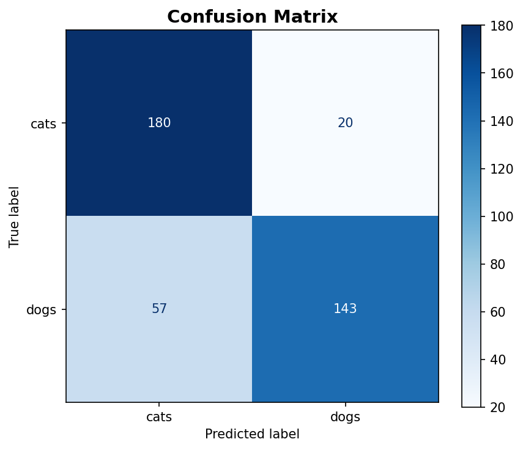

# Cat and Dog Image Classification

An image-classification project that distinguishes cats and dogs using a custom convolutional neural network (CNN) built with PyTorch.

The project includes data augmentation, early stopping, Optuna hyperparameter optimisation, visualisation of model behaviour, and an EfficientNet-B0 transfer-learning comparison.

## Collaboration

Developed collaboratively with two groupmates during an overseas exchange programme.

## Key features

- Custom CNN with four convolutional blocks and global average pooling
- Image augmentation for improved generalisation
- AdamW optimiser, learning-rate scheduling, and early stopping
- Optuna hyperparameter tuning for batch size, learning rate, weight decay, and patience
- Model evaluation with a confusion matrix and misclassified-image analysis
- Fine-tuned EfficientNet-B0 baseline using transfer learning

## Results

> **Reproducibility note:** While exact accuracy values differ from the [project report](docs/project_report.pdf), this local reproduction reached the same overall conclusions.

| Model | Test accuracy |
| Custom CNN with Optuna-tuned hyperparameters | 80.75% |
| Fine-tuned EfficientNet-B0 | 93.75% |

## Visualisations

### Training curves



### Confusion matrix



Additional visualisations are available in [`outputs/visualizations`](outputs/visualizations).

## Project structure

```text
.
├── catdog_classification.ipynb  # Main notebook
├── catdog_data.zip              # Dataset
├── docs/
│   └── project_report.pdf       # Project report
├── outputs/
│   └── visualizations/          # Generated figures
├── requirements.txt             # Python dependencies
└── README.md
```

## Experiment controls

The notebook first runs a 20-trial Optuna search to select hyperparameters for the custom CNN, then fine-tunes an EfficientNet-B0 model for comparison.

```python
RUN_OPTUNA_TUNING = True  # Set to False to skip Optuna tuning
RUN_BONUS = True          # Set to False to skip EfficientNet-B0 fine-tuning
```